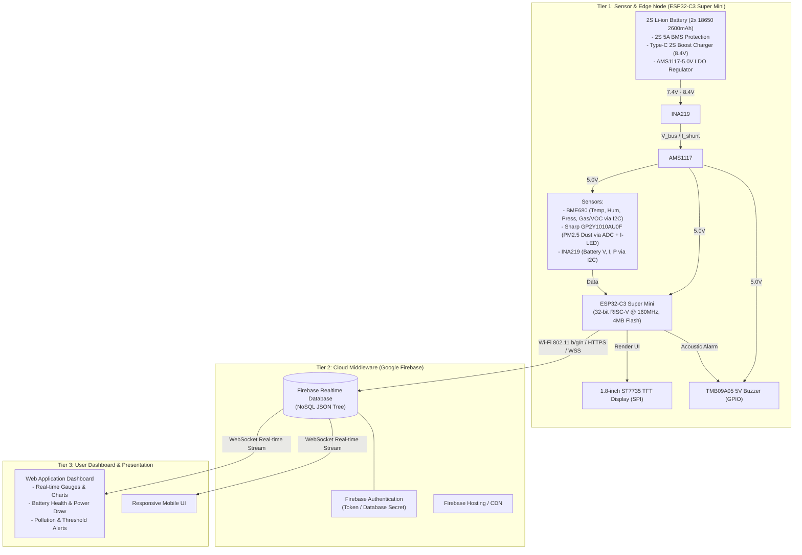
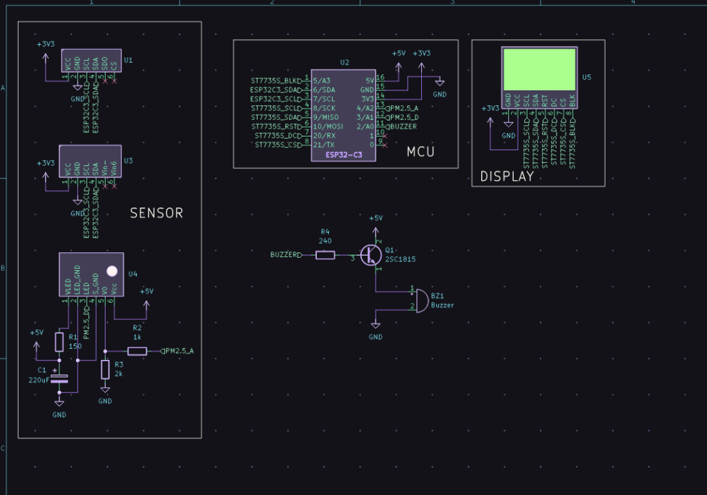

# Indoor Air Quality (IAQ) & Energy Monitoring IoT System

[](https://opensource.org/licenses/MIT)
[](https://www.espressif.com/en/products/socs/esp32-c3)
[](https://platformio.org/)
[](https://firebase.google.com/)

An edge-computing Internet of Things (IoT) station designed for real-time indoor environmental quality monitoring and autonomous power management. Powered by an ultra-compact **ESP32-C3 Super Mini (RISC-V)** microcontroller, the device integrates multi-sensor environmental sensing (PM2.5, VOC, Temperature, Humidity, Pressure), on-device visual feedback (1.8" ST7735 TFT), local acoustic alerts, a rechargeable 2S Li-ion battery subsystem with real-time power telemetry (INA219), and cloud synchronization with **Google Firebase**.

---

## 1. System Architecture

The project follows a modular **Three-Tier IoT Architecture**:



---

## 2. Hardware Bill of Materials (BOM)

| Component | Specification / Model | Interface | Function / Purpose |
| :--- | :--- | :--- | :--- |
| **Microcontroller (MCU)** | ESP32-C3 Super Mini (4MB Flash, RISC-V @ 160MHz) | Wi-Fi / BLE | Core controller, sensor aggregation, cloud comms |
| **Environmental Sensor** | Bosch BME680 | I2C (0x77 / 0x76) | Ambient Temp, Relative Humidity, Pressure, Gas/VOC |
| **Particulate Sensor** | Sharp GP2Y1010AU0F | Analog ADC + Digital GPIO | PM2.5 Optical Dust Density detection |
| **Energy Monitor** | INA219 MCU-219 | I2C (0x40) | 2S Battery bus voltage, discharge current, power draw |
| **Display** | 1.8-inch TFT LCD (ST7735 controller, 128x160) | SPI | Local graphical dashboard and status readouts |
| **Acoustic Indicator** | TMB09A05 5V Active Buzzer (9x5.5mm) | GPIO (via Transistor) | Audible alarms for hazardous IAQ and low battery |
| **Battery Cells** | 2x 18650 Li-ion Cells (2600 mAh each in 2S1P) | Battery Holder | Portable power source (Nominal: 7.4V, Full: 8.4V) |
| **Battery Management** | 2S 5A Lithium Protection Board (BMS) | Direct Battery | Overcharge, over-discharge, overcurrent & short-circuit protection |
| **Charger Board** | Type-C 3-6V to 2S-2A (8.4V) Boost Charger | USB Type-C | Fast, universal USB-C charging for 2S pack |
| **Voltage Regulator** | AMS1117-5.0V LDO Module | Power Rail | Steps down 7.4-8.4V battery output to stable 5.0V |

---

## 3. Hardware Circuit Schematic

The circuit schematic has been designed in KiCad and verified on physical prototype board:



> **KiCad Design Source Files:** Available in [`hardware/schematics/`](hardware/schematics/) (`1.kicad_sch`, `1.kicad_pro`, `New_Library_1.kicad_sym`).

---

## 4. Repository Structure & Documentation

This repository is organized into distinct functional directories:

```text
├── hardware/
│   └── schematics/                # KiCad CAD schematic & visual diagram
│       ├── 1.kicad_sch            # KiCad schematic source file
│       ├── 1.kicad_pro            # KiCad project file
│       └── circuit_schematic.png  # Rendered KiCad schematic image
├── docs/
│   ├── system-spec/               # Technical system specifications
│   │   ├── 01_system_architecture.md
│   │   ├── 02_hardware_specification.md
│   │   ├── 03_circuit_and_pinout.md
│   │   ├── 04_software_and_cloud_spec.md
│   │   └── 05_power_management.md
│   ├── roadmap/                   # Project planning, Gantt, and RACI
│   │   ├── timeline_and_milestones.md
│   │   ├── task_assignment_raci.md
│   │   └── progress_tracker.md
│   ├── weekly-reports/            # Weekly progress tracking
│   │   ├── week-01.md
│   │   ├── week-02.md
│   │   └── week-03.md
│   └── reports/                   # Academic & Engineering Project Reports
│       ├── chapter_1_introduction.md
│       ├── chapter_2_theoretical_background.md
│       ├── chapter_3_hardware_software_design.md
│       ├── chapter_4_implementation_testing.md
│       └── chapter_5_conclusion_future_work.md
└── src/
    ├── firmware/                  # ESP32-C3 Arduino firmware (firmware.ino, firebase_config.h)
    ├── cloud-firebase/            # Firebase RTDB rules and sample telemetry schemas
    └── frontend/                  # Web Dashboard application (HTML5/CSS3/JS, Chart.js)
```

---

## 5. Software & Cloud Subsystems

- **ESP32-C3 Firmware ([`src/firmware/`](src/firmware/)):** The core firmware sketch ([`firmware.ino`](src/firmware/firmware.ino)) coordinates sensor acquisitions, ST7735 TFT graphical rendering (4-panel UI), 2S battery gauge monitoring, acoustic alarm triggering, and configured credentials ([`firebase_config.h`](src/firmware/firebase_config.h)). Can be edited and flashed using Arduino IDE or PlatformIO.
- **Cloud Backend ([`src/cloud-firebase/`](src/cloud-firebase/)):** Google Firebase Realtime Database schema and security rules for real-time station telemetry streaming.
- **User Web Dashboard ([`src/frontend/`](src/frontend/)):** Real-time monitoring dashboard ([`index.html`](src/frontend/index.html)) with live Chart.js trend visualization directly synced via Firebase WebSocket.

---

## 6. License
This project is licensed under the MIT License - see the [LICENSE](LICENSE) file for details.
