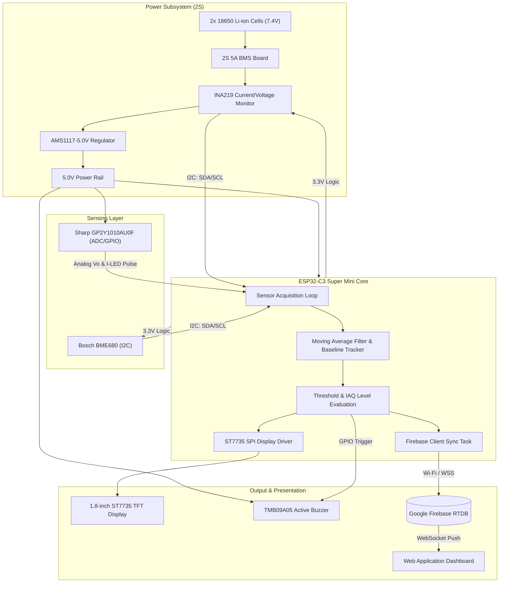

# Chapter 2: Theoretical Background & System Design

## 2.1. Indoor Air Quality (IAQ) Metrics & International Standards

Indoor Air Quality (IAQ) refers to the chemical, physical, and biological characteristics of air within buildings and structures as they relate to the health, comfort, and productivity of occupants. Evaluating IAQ requires quantifying multiple independent airborne metrics against established environmental health guidelines.

### 2.1.1. Fine Particulate Matter ($PM_{2.5}$ and $PM_{10}$)
Particulate matter represents a complex mixture of microscopic solid particles and liquid droplets suspended in the air. Particles are categorized by their aerodynamic diameter:
- **Coarse Particulates ($PM_{10}$):** Particles with diameters between $2.5 \, \mu m$ and $10 \, \mu m$ (e.g., pollen, coarse dust, mold spores).
- **Fine Particulates ($PM_{2.5}$):** Particles with aerodynamic diameters $\le 2.5 \, \mu m$ (e.g., combustion particles, organic compounds, heavy metals).

Because $PM_{2.5}$ particles remain suspended in ambient air for prolonged durations and readily penetrate deep into the alveolar regions of the human respiratory system, international regulatory bodies enforce stringent thresholds. The World Health Organization (WHO) and the United States Environmental Protection Agency (US-EPA) define air quality rating categories based on 24-hour average $PM_{2.5}$ concentrations:

| EPA Air Quality Category | $PM_{2.5}$ Concentration Range ($\mu g/m^3$) | Health Implications for Occupants |
| :--- | :---: | :--- |
| **Good** | $0.0 - 12.0$ | Air quality is considered satisfactory; air pollution poses little or no risk. |
| **Moderate** | $12.1 - 35.4$ | Acceptable air quality; slight risk for unusually sensitive individuals. |
| **Unhealthy for Sensitive Groups** | $35.5 - 55.4$ | Members of sensitive groups may experience respiratory irritation. |
| **Unhealthy** | $55.5 - 150.4$ | General public may begin to experience health effects; sensitive groups affected more severely. |
| **Very Unhealthy / Hazardous** | $\ge 150.5$ | Health alert: serious risk of respiratory and cardiovascular impairment for all occupants. |

### 2.1.2. Volatile Organic Compounds (VOCs)
Volatile Organic Compounds encompass a diverse class of carbon-based chemicals exhibiting high vapor pressure under standard room temperatures ($20^\circ C - 25^\circ C$). Common indoor VOCs include formaldehyde ($HCHO$), benzene ($C_6H_6$), toluene, and ethanol. Total Volatile Organic Compound (TVOC) concentration serves as a vital index for chemical indoor air quality. Prolonged exposure causes irritation of the eyes and respiratory tract, chronic headaches, and increased long-term oncological risks.

### 2.1.3. Microclimate Variables: Temperature, Humidity, and Pressure
Ambient thermal parameters directly influence chemical off-gassing rates and biological contamination:
- **Temperature ($T$):** Elevated indoor temperatures accelerate the evaporation and emission rates of VOCs from building materials.
- **Relative Humidity ($RH$):** High humidity ($RH > 65\%$) creates an ideal environment for mold propagation, dust mite proliferation, and bacterial colonization, whereas low humidity ($RH < 30\%$) irritates respiratory mucous membranes.
- **Barometric Pressure ($P$):** Atmospheric pressure gradients govern air infiltration rates between indoor zones and outdoor air.

---

## 2.2. Sensing Principles & Transducer Technologies

### 2.2.1. Optical Particulate Detection: Sharp GP2Y1010AU0F
The Sharp GP2Y1010AU0F dust sensor employs the **light scattering principle**. Inside the optical chamber, an Infrared Emitting Diode (IRED) and a phototransistor are positioned diagonally.

```
       [IRED Pulse Generator] 
                 \
                  \  Incident IR Beam (lambda = 850nm)
                   \
               [Dust Particles] ---> Scattered Light Rays
                     \
                      \  Scattered Beam
                       v
              [Phototransistor Receiver]
                       |
                       v
         [Signal Conditioning Amplifier]
                       |
                       v
           Analog Output Voltage (V_o)
```

1. **Pulse Activation:** When the internal IRED is pulsed with a narrow forward current pulse, an infrared light beam traverses the sensing chamber.
2. **Rayleigh/Mie Scattering:** Suspended dust particles crossing the optical path scatter light at an angle proportional to particle surface area and density.
3. **Phototransistor Detection:** The phototransistor collects a portion of the scattered light, generating a photocurrent that is internally amplified into an analog output voltage $V_o$.
4. **Timing Constraints:** To prevent thermal drift and minimize power consumption, the IRED must be pulsed with strict timing:
   - Pulse period $T = 10 \, ms$.
   - Pulse duration $\tau = 0.32 \, ms$ ($320 \, \mu s$).
   - Sampling instant $t_{sample} = 0.28 \, ms$ ($280 \, \mu s$) from pulse initiation.
5. **Transfer Function & Hardware Scaling:** Because the sensor output $V_o$ can reach $\approx 4.5V - 5.0V$, a resistive voltage divider steps the signal down to the ESP32-C3 ADC range ($\le 3.3V$), introducing a scaling correction factor of $1.5\times$:
   $$V_{Vo} = V_{ADC} \times 1.5$$
   The calibrated particulate mass concentration $D$ (in $\text{mg/m}^3$) is calculated as:
   $$D \, (\text{mg/m}^3) = \max\left(0.0, \; 0.17 \times V_{Vo} - 0.1\right)$$
   and converted to standard $\mu\text{g/m}^3$ via:
   $$D \, (\mu\text{g/m}^3) = D \, (\text{mg/m}^3) \times 1000$$

### 2.2.2. Metal Oxide Semiconductor (MOX) Gas Sensing: Bosch BME680
The BME680 integrates an ambient temperature sensor, capacitive humidity sensor, piezoresistive barometric pressure sensor, and a metal-oxide (MOX) gas sensor onto a single monolithic silicon die.

- **Operating Principle:** The gas sensor utilizes a heated thin-film layer of metal oxide semiconductor (typically tin dioxide, $SnO_2$). In clean ambient air, atmospheric oxygen molecules adsorb onto the $SnO_2$ crystal surface, capturing conduction-band electrons to form negative surface oxygen ions ($O^-, O_2^-$). This forms a high-resistance potential barrier at inter-grain boundaries:
  $$O_2(gas) + 2e^- \rightarrow 2O^-(ads)$$
- **Reaction with Reducing VOC Gases:** When volatile organic compounds (e.g., ethanol, formaldehyde, carbon monoxide) contact the heated metal-oxide surface ($300^\circ C - 320^\circ C$), they react with the adsorbed oxygen ions, releasing captured electrons back into the conduction band:
  $$R\text{-}H + O^-(ads) \rightarrow R\text{-}OH + e^-$$
- **Resistance Reduction:** This electron release diminishes the potential barrier, causing a sharp reduction in electrical resistance across the sensor film ($R_{gas}$). The measured resistance $R_{gas}$ is inversely related to VOC concentration.

### 2.2.3. High-Side Shunt Energy Monitoring: INA219
The Texas Instruments INA219 is a high-side current shunt and power monitor with an I2C interface.

```
       V_bat (+) ------+--------------------+------ Load Rail (AMS1117-5.0V)
                       |                    |
                     [VIN+]               [VIN-]
                       |                    |
                       +-----[ R_shunt ]----+  (R_shunt = 0.1 Ohm)
                                  |
                                  v
                     [Differential PGA (x1 - x8)]
                                  |
                                  v
                     [12-bit Delta-Sigma ADC]
                                  |
                                  v
                     [Internal Digital Multiplier]
                                  |
                                  v
                        [I2C Register Interface]
```

- **Shunt Voltage Measurement:** Measures the differential voltage drop across a precision shunt resistor ($R_{shunt} = 0.1 \, \Omega$, 1% tolerance) inserted in series between the battery positive terminal and the load:
  $$V_{shunt} = V_{IN+} - V_{IN-}$$
- **Current Derivation:** Current is computed digitally inside the INA219:
  $$I = \frac{V_{shunt}}{R_{shunt}}$$
- **Bus Voltage Measurement:** The voltage between the $V_{IN-}$ pin and system ground ($GND$) represents the actual battery bus voltage $V_{bus}$.
- **Power Derivation:** Instantaneous system power is calculated as:
  $$P = V_{bus} \times I$$

---

## 2.3. Microcontroller Architecture: ESP32-C3 Super Mini

The central processing unit of the monitoring station is the **ESP32-C3 Super Mini**, an ultra-low-power, high-performance System-on-Chip (SoC) developed by Espressif Systems:
- **Processor Core:** 32-bit RISC-V single-core microprocessor (RV32IMC instruction set architecture) operating at clock frequencies up to $160 \, MHz$.
- **Memory Subsystem:**
  - $400 \, KB$ of internal SRAM for data storage and dynamic memory allocation.
  - $384 \, KB$ of internal ROM for booting and core library routines.
  - $4 \, MB$ of external Quad-SPI Flash memory integrated on-module for firmware code, assets, and configuration.
- **Wireless Networking:**
  - Integrated 2.4 GHz Wi-Fi subsystem compliant with IEEE 802.11 b/g/n, supporting HT20/HT40 bandwidths with data rates up to $150 \, Mbps$.
  - Bluetooth 5 (LE) supporting 2 Mbps PHY, long range, and broadcast advertising.
- **Integrated Hardware Peripherals:**
  - 12-bit Successive Approximation Register (SAR) Analog-to-Digital Converter (ADC) across multiple channels.
  - Hardware I2C master controller supporting standard ($100 \, kHz$) and fast ($400 \, kHz$) modes.
  - General-Purpose SPI controller capable of high-speed transmission up to $40 \, MHz$, critical for smooth TFT display refreshing.
  - General-Purpose Input/Output (GPIO) matrix with configurable pull-up, pull-down, and drive strengths.

---

## 2.4. Cloud Middleware & Synchronization: Google Firebase

To deliver real-time data streaming and remote dashboard access without managing dedicated server infrastructure, the platform leverages **Google Firebase**:

```
[ESP32-C3 Edge Node] 
        |
        | Secure TLS / HTTPS / WebSocket Stream
        v
[Firebase Realtime Database (RTDB)] <--- NoSQL JSON Tree
        |
        | Server-Sent Events (SSE) / WebSocket Push
        v
[Client Web Dashboard (HTML5/JS)]
```

1. **Firebase Realtime Database (RTDB):** A cloud-hosted NoSQL document database where data is structured as a single hierarchical JSON tree. Unlike traditional SQL databases that require polling, Firebase pushes updates to connected clients in real time over persistent WebSocket connections.
2. **Low-Latency Bi-Directional Synchronization:** When the ESP32-C3 executes a `setJSON()` or `updateNode()` operation, the updated environmental state is propagated to all open web dashboard instances within milliseconds.
3. **Offline Caching & Data Resiliency:** The client-side Firebase JavaScript SDK provides local caching capabilities, maintaining seamless dashboard interactivity during intermittent network disconnects.
4. **Security Enforcement:** Declarative JSON security rules govern read/write permissions, validating that incoming sensor payloads adhere to expected schema definitions and type constraints.

---

## 2.5. Autonomous Power Subsystem & Energy Modeling

### 2.5.1. 2S Li-ion Battery Configuration
To provide untethered mobility, the system is powered by two cylindrical Lithium-ion 18650 cells connected in series (2S1P configuration):
- **Nominal Pack Voltage:** $2 \times 3.7V = 7.4V$.
- **Full Charge Pack Voltage:** $2 \times 4.2V = 8.4V$.
- **Cutoff / Depleted Pack Voltage:** $2 \times 3.0V = 6.0V$.
- **Nominal Cell Capacity:** $2600 \, mAh$ ($2.6 \, Ah$).
- **Total Pack Energy:**
  $$E = V_{nominal} \times C = 7.4V \times 2.6Ah = 19.24 \, \text{Wh}$$

### 2.5.2. Battery Management System (BMS 2S 5A)
Lithium-ion cells require active electronic protection against hazardous operating regimes:
- **Overcharge Cutoff ($V_{ovp}$):** $4.25V \pm 0.05V$ per cell. Disconnects charging current to prevent thermal runaway.
- **Over-discharge Cutoff ($V_{uvp}$):** $2.50V \pm 0.08V$ per cell. Disconnects the load to protect cell chemistry against irreversible copper dissolution.
- **Overcurrent Protection:** Automatically interrupts conduction if discharge current exceeds $10A$ peak or $5A$ continuous.

### 2.5.3. Type-C 2S Boost Charger (8.4V, 2A)
The charger board utilizes a high-efficiency synchronous boost switching converter:
- Converts standard $5.0V$ USB input (from smartphone chargers or power banks) up to the $8.4V$ required for 2S charging.
- Executes the standard two-phase **Constant Current / Constant Voltage (CC/CV)** charging profile:
  - **CC Phase:** Delivers up to $2.0A$ constant current while the pack voltage rises from $6.0V$ toward $8.4V$.
  - **CV Phase:** Maintains exactly $8.40V$ while charging current exponentially decays to the termination threshold ($C/10 \approx 200mA$).

### 2.5.4. Linear Voltage Regulation: AMS1117-5.0V
The AMS1117-5.0V Low Dropout (LDO) regulator steps down the variable battery pack voltage ($7.4V - 8.4V$) to a stable $5.0V$ rail:
- Supplies the Sharp GP2Y1010AU0F optical dust sensor ($5V \pm 10\%$).
- Supplies the TMB09A05 active buzzer ($5V$).
- Feeds the $VIN$ pin of the ESP32-C3 Super Mini, whose internal onboard LDO further steps down $5.0V$ to $3.3V$ for the RISC-V core, BME680, and ST7735 logic.
- **LDO Efficiency:**
  $$\eta_{LDO} = \frac{V_{out}}{V_{in}} = \frac{5.0V}{7.4V} \approx 67.5\% \quad (\text{at nominal battery voltage})$$
  Power dissipated as heat:
  $$P_{diss} = (V_{in} - V_{out}) \times I_{load} = (7.4V - 5.0V) \times 0.15A \approx 0.36 \, W$$

---

## 2.6. Proposed System Architecture & Design

The functional architecture integrates the sensing transducers, edge processing, visual/acoustic alerting, and cloud synchronization into an interdependent pipeline:


