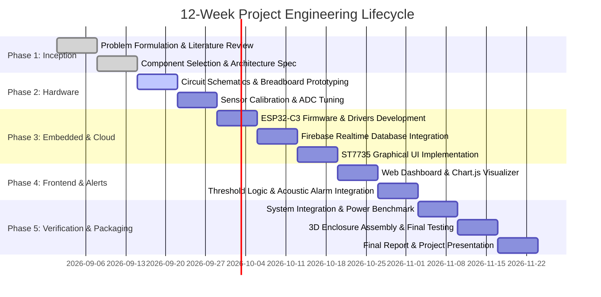

# Project Roadmap: Timeline & Milestones

## 1. Project Overview & Execution Strategy

The Indoor Air Quality (IAQ) and Energy Monitoring IoT System follows a structured **12-Week Agile Engineering Lifecycle**. The roadmap is divided into five distinct phases, ensuring iterative validation across hardware design, embedded firmware development, cloud integration, and experimental evaluation.

---

## 2. Weekly Milestone Breakdown

### Phase 1: Inception & Technical Specification (Weeks 1 – 2)
- **Week 1: Problem Formulation & Background Study**
  - Define problem statement: Indoor air pollution hazards (PM2.5, VOCs, ventilation efficacy).
  - Review international air quality standards (WHO Air Quality Guidelines, US-EPA AQI).
  - Formulate technical requirements and initial system scope.
  - Complete **Chapter 1: Introduction**.
- **Week 2: Component Selection & System Architecture**
  - Evaluate microcontroller platforms: ESP32-C3 Super Mini (RISC-V architecture).
  - Select sensing transducers: Sharp GP2Y1010AU0F (PM2.5), Bosch BME680 (4-in-1 VOC/Temp/Hum/Press), INA219 (Energy).
  - Design 2S Li-ion battery subsystem (18650, 2S 5A BMS, Type-C 2S Boost Charger, AMS1117-5.0V).
  - Complete **Chapter 2: Theoretical Background & System Design**.

### Phase 2: Hardware Prototyping & Sensor Validation (Weeks 3 – 4)
- **Week 3: Circuit Design & Breadboard Assembly**
  - Verify pinout mappings on ESP32-C3 Super Mini.
  - Wire the I2C bus (BME680, INA219) with pull-up resistors.
  - Assemble the Sharp GP2Y1010AU0F RC pulse circuit ($150\Omega$ resistor and $220\mu F$ capacitor).
  - Validate 2S BMS protection board and Type-C boost charger functionality.
- **Week 4: Sensor Interfacing & Signal Calibration**
  - Implement microsecond-accurate pulse timing for GP2Y1010AU0F ($0.28ms$ delay, $0.32ms$ total pulse).
  - Calibrate ADC readings against baseline clean air values and implement a 10-sample moving average filter.
  - Test BME680 I2C communication and burn-in the MOX gas hotplate.

### Phase 3: Embedded Firmware & Cloud Integration (Weeks 5 – 7)
- **Week 5: Core Firmware Architecture**
  - Structure modular C/C++ firmware in PlatformIO.
  - Implement non-blocking state machine and cooperative timing tasks.
  - Read INA219 bus voltage and discharge current to compute State-of-Charge (SoC).
- **Week 6: Google Firebase Realtime Database Integration**
  - Configure Firebase project, Realtime Database (RTDB), and security rules.
  - Integrate `Firebase-ESP-Client` library with ESP32-C3 over Wi-Fi.
  - Implement JSON payload serialization and transmit live telemetry every 5 seconds.
- **Week 7: Graphical User Interface on 1.8" ST7735 TFT**
  - Initialize 4-wire SPI communication for ST7735 LCD (128x160 resolution).
  - Design graphical dashboard layout: Air Quality Status banner, PM2.5 gauge, Temp/Hum readouts, and Battery SoC icon.

### Phase 4: Client Dashboard & Acoustic Alerting (Weeks 8 – 9)
- **Week 8: Web Dashboard Development**
  - Develop responsive HTML5/CSS3/JavaScript web interface.
  - Integrate Firebase JavaScript SDK v9/v10 for real-time WebSocket data streaming.
  - Render dynamic time-series charts using Chart.js.
- **Week 9: Threshold Alarms & Acoustic System**
  - Assemble NPN transistor driving circuit for the TMB09A05 5V active buzzer.
  - Implement multi-level alert triggers (Warning vs. Critical alarm).
  - Synchronize alert states between the edge device and web dashboard.

### Phase 5: Verification, Packaging & Final Documentation (Weeks 10 – 12)
- **Week 10: End-to-End System Testing & Power Benchmarking**
  - Perform continuous 24-hour stability testing.
  - Measure actual current draw under active Wi-Fi and power-save modes using INA219.
  - Validate battery operating autonomy against theoretical calculations.
- **Week 11: Enclosure Integration & Mechanical Assembly**
  - Design and fabricate enclosure for the sensor node, battery pack, and display.
  - Finalize cable routing, isolation, and airflow channels for the particulate and gas sensors.
  - Complete **Chapter 3: Detailed Design** and **Chapter 4: Implementation & Evaluation**.
- **Week 12: Final Review & Project Delivery**
  - Perform final code audit, repository cleanup, and documentation verification.
  - Complete **Chapter 5: Conclusion & Future Work**.
  - Prepare demonstration materials and presentation slides.
