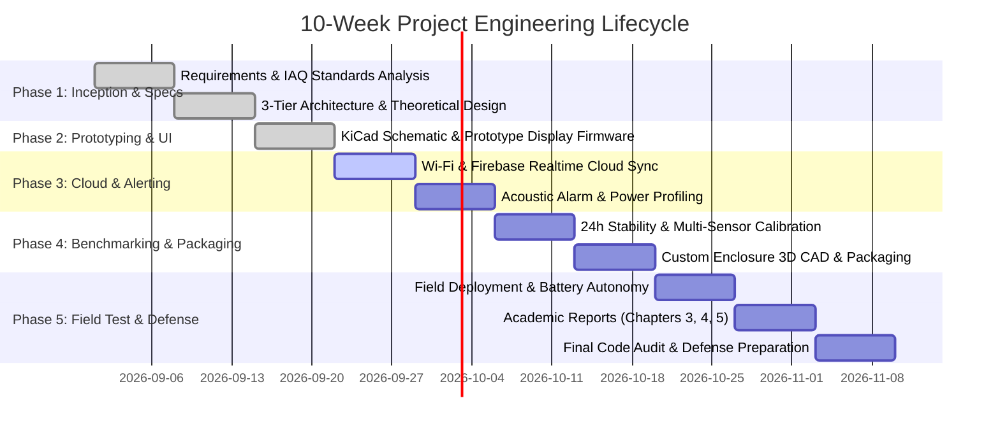

# Project Roadmap: Timeline & Milestones

## 1. Project Overview & Execution Strategy

The Indoor Air Quality (IAQ) and Energy Monitoring IoT System follows a structured **10-Week Agile Engineering Lifecycle**. The roadmap is organized across five focused phases, ensuring rigorous milestone validation from hardware prototyping to cloud integration and experimental evaluation.

---

## 2. Weekly Milestone Breakdown

### Phase 1: Inception & Technical Specification (Weeks 1 – 2)
- **Week 1: Problem Formulation & Requirements Analysis**
  - Define project scope: Indoor air pollution hazards (PM2.5, VOCs, thermal indices).
  - Review international air quality standards (WHO Air Quality Guidelines, US-EPA AQI).
  - Formulate hardware bill of materials (BOM) and system design boundaries.
  - Complete **Chapter 1: Introduction**.
- **Week 2: System Architecture & Technical Specifications**
  - Formulate 3-Tier IoT System Architecture (Sensor Node $\rightarrow$ Google Firebase $\rightarrow$ Web Dashboard).
  - Select core hardware: ESP32-C3 Super Mini, Bosch BME680, Sharp GP2Y1010AU0F, INA219, ST7735 TFT.
  - Design 2S Li-ion battery power subsystem (18650 cells, 2S 5A BMS, Type-C boost charger, AMS1117-5.0V).
  - Compile Technical System Specifications (`docs/system-spec/01` to `05`).
  - Complete **Chapter 2: Theoretical Background & System Design**.

### Phase 2: Hardware Prototyping & Local Firmware (Week 3)
- **Week 3: KiCad Schematic, Prototype Board & Display Firmware (Current)**
  - Procure all physical Bill of Materials (BOM) components.
  - Author complete electronic circuit schematic in KiCad (`hardware/schematics/1.kicad_sch`, `circuit_schematic.png`).
  - Wire and assemble physical prototype circuit board with sensors, display, and power distribution rails.
  - Implement and flash verified primary firmware (`src/firmware/firmware.ino`):
    - ST7735 1.8" TFT 4-panel graphical layout (`TEMP`, `HUMI`, `PM2.5`, `GAS`).
    - 2S Battery SoC gauge with voltage, discharge current, and color-coded icon.
    - Optical dust sensor microsecond pulse driver with hardware $1.5\times$ divider scaling.
    - Acoustic double-chirp startup notification and buzzer threshold alarm.
  - Construct Web Dashboard layout (`src/frontend/index.html`, `app.js`) and configure Firebase parameters (`src/firmware/firebase_config.h`).

### Phase 3: Cloud Telemetry & System Integration (Weeks 4 – 5)
- **Week 4: Wi-Fi Connectivity & Firebase Realtime Cloud Sync**
  - Connect ESP32-C3 to local Wi-Fi access point using credentials in `firebase_config.h`.
  - Implement periodic JSON telemetry push from `firmware.ino` to Firebase RTDB node `/iaq_stations/ESP32C3_STATION_01/current`.
  - Validate live WebSocket streaming from Firebase to the Web Dashboard with dynamic Chart.js rendering.
  - Implement automatic Wi-Fi reconnection handling for resilient edge operation.
- **Week 5: Acoustic Alarm Thresholding & Power Profiling**
  - Calibrate dynamic acoustic alarm patterns (Warning vs. Critical alarm for PM2.5 and low battery).
  - Measure active current draw vs. idle current draw across operating modes using INA219.
  - Benchmark battery operating life under varying Wi-Fi transmission intervals (5s, 15s, 60s).

### Phase 4: Stability Benchmarking & Packaging (Weeks 6 – 7)
- **Week 6: 24-Hour Continuous Testing & Multi-Sensor Calibration**
  - Conduct continuous 24-hour stability bench run without memory leaks or Wi-Fi drops.
  - Calibrate Sharp GP2Y1010AU0F zero-dust baseline voltage in a sealed clean chamber.
  - Evaluate Bosch BME680 gas resistance baseline stabilization and thermal compensation.
  - Audit Firebase security rules and real-time database transmission efficiency.
- **Week 7: Protective Enclosure Design & Mechanical Assembly**
  - 3D CAD design of compact station enclosure with isolated sensor airflow channels.
  - 3D print enclosure body and faceplate for 1.8" ST7735 TFT and external Type-C port.
  - Assemble sensor board, 2S 18650 battery pack, and BMS inside enclosure with secure standoffs.

### Phase 5: Field Evaluation & Final Defense (Weeks 8 – 10)
- **Week 8: Environmental Field Testing & Long-Term Evaluation**
  - Deploy assembled IoT station in distinct indoor environments (office, kitchen, laboratory).
  - Log real-time air quality events (cooking fumes, dust disturbance, ventilation changes).
  - Record empirical battery discharge curve and compare against theoretical 2S model.
- **Week 9: Academic Project Reports (Chapters 3, 4, 5)**
  - Author **Chapter 3: Detailed Hardware & Software Design**.
  - Author **Chapter 4: Implementation, Testing & Experimental Evaluation**.
  - Author **Chapter 5: Conclusion & Future Work**.
- **Week 10: Final System Audit & Project Defense**
  - Comprehensive codebase audit, repository polishing, and release tagging (`v1.0.0`).
  - Record end-to-end video demonstration showcasing sensor detection, cloud streaming, and web graphs.
  - Prepare technical defense presentation slides and final submission deliverables.
