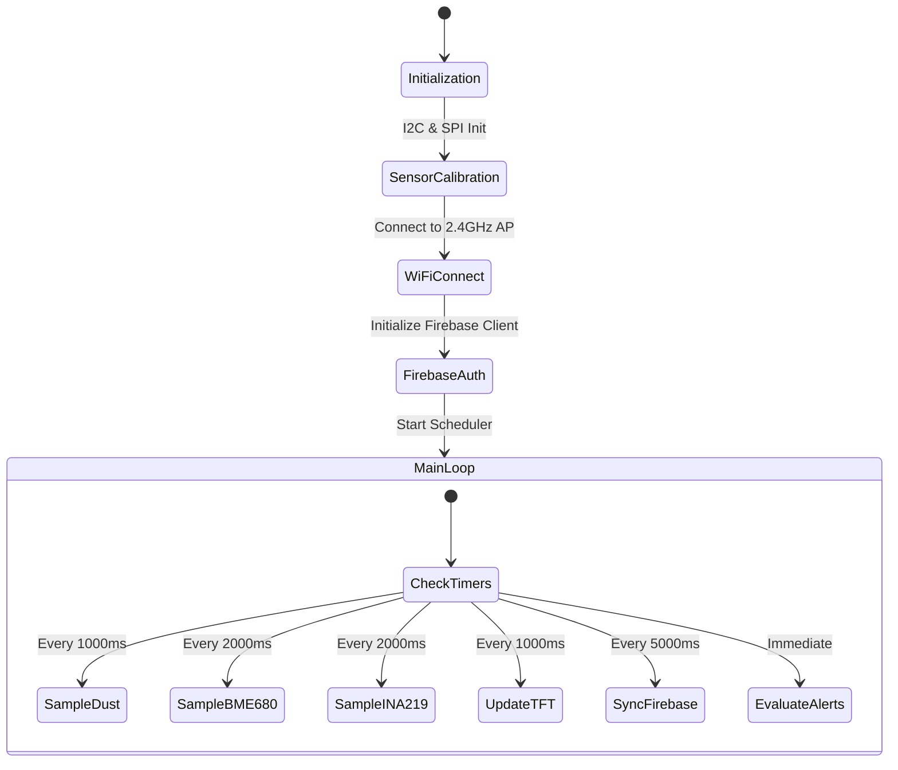

# 04. Software & Cloud Specification

## 1. Firmware Architecture (C/C++)

The firmware is developed using the **PlatformIO ecosystem** on the **Arduino Framework** for the ESP32-C3. The software executes a non-blocking, multi-interval scheduling loop to ensure timely sensor sampling, local rendering, and network synchronization.



---

## 2. Sensor Signal Processing Algorithms

### 2.1. Sharp GP2Y1010AU0F Microsecond Timing & Calibration
The optical dust sensor requires precise microsecond-level timing to energize the infrared emitter diode (IRED) and sample the scattered light pulse:

1. Drive `GPIO 1` LOW to activate the IRED.
2. Wait precisely $280 \mu s$ ($0.28 ms$) for the light pulse to stabilize.
3. Read the analog voltage on `GPIO 0` using the 12-bit ADC (sampling time $\approx 40 \mu s$).
4. Drive `GPIO 1` HIGH to deactivate the IRED (total pulse duration: $320 \mu s$).
5. Delay for $9680 \mu s$ before the next allowable pulse ($10 ms$ total cycle).

#### Mathematical Conversion:
$$\text{Measured Voltage } V_{ADC} = ADC\_Value \times \left(\frac{3.3V}{4095}\right)$$

Applying the Sharp linear transfer characteristic curve:
$$\text{Dust Density } (\mu g/m^3) = \max\left(0.0, \; (0.17 \times V_{ADC} - 0.1) \times 1000\right)$$

A **10-sample Moving Average Filter (MAF)** is applied to eliminate sudden noise spikes caused by turbulence:
$$\bar{D}_k = \frac{1}{N} \sum_{i=0}^{N-1} D_{k-i}, \quad N = 10$$

### 2.2. BME680 Gas Resistance & IAQ Estimation
The BME680 incorporates a metal-oxide (MOX) gas sensor heated to 320°C for 150 ms before readout. Higher gas resistance ($R_{gas}$ in $k\Omega$) indicates cleaner air, while lower resistance corresponds to elevated volatile organic compounds (VOCs).

- **Baseline Calibration:** The system records a 24-hour maximum resistance $R_{base}$ representing clean ambient air.
- **Air Quality Ratio:**
  $$\text{VOC Ratio} = \frac{R_{gas}}{R_{base}}$$
- **Categorization:**
  - $R_{gas} \ge 150 \, k\Omega$: Good (clean indoor air).
  - $50 \, k\Omega \le R_{gas} < 150 \, k\Omega$: Moderate.
  - $R_{gas} < 50 \, k\Omega$: Hazardous (Elevated VOC / cooking smoke / solvent vapors).

### 2.3. Battery State-of-Charge (SoC) Calculation
The INA219 measures the 2S battery pack bus voltage ($V_{bus}$). The remaining capacity percentage is derived using a piece-wise linear approximation of the Li-ion discharge curve:

$$\text{SoC } (\%) = \begin{cases} 
100\% & \text{if } V_{bus} \ge 8.4V \\
\frac{V_{bus} - 6.0V}{8.4V - 6.0V} \times 100\% & \text{if } 6.0V < V_{bus} < 8.4V \\
0\% & \text{if } V_{bus} \le 6.0V 
\end{cases}$$

---

## 3. Google Firebase Cloud Specification

### 3.1. Database Architecture
Data is synchronized to the **Firebase Realtime Database (RTDB)** using an optimized JSON hierarchical structure:

```json
{
  "iaq_stations": {
    "ESP32C3_STATION_01": {
      "metadata": {
        "firmware_version": "1.0.0",
        "device_name": "Living Room Monitor",
        "last_seen": 1726848000
      },
      "live_metrics": {
        "temperature_c": 26.4,
        "humidity_pct": 58.1,
        "pressure_hpa": 1013.2,
        "gas_resistance_kohm": 142.5,
        "pm25_ug_m3": 18.3,
        "iaq_grade": "GOOD",
        "timestamp": 1726848000
      },
      "power_telemetry": {
        "bus_voltage_v": 7.94,
        "current_ma": 92.6,
        "power_mw": 735.2,
        "battery_pct": 81,
        "charging_state": false
      },
      "alerts": {
        "active": false,
        "type": "NONE",
        "message": "Air quality is optimal."
      },
      "history": {
        "-O7x9A1b2c3d4e5f": {
          "timestamp": 1726848000,
          "pm25": 18.3,
          "voc_kohm": 142.5,
          "temp": 26.4,
          "hum": 58.1,
          "v_bat": 7.94
        }
      }
    }
  }
}
```

### 3.2. Firebase Security Rules
Granular rules enforce that the ESP32-C3 can only write to its designated station node while authenticated:

```json
{
  "rules": {
    "iaq_stations": {
      "$station_id": {
        ".read": true,
        ".write": "auth != null || auth.uid === $station_id"
      }
    }
  }
}
```

---

## 4. Alert & Threshold Logic

| Parameter | Warning Threshold | Critical Alarm Threshold | Action Taken |
| :--- | :--- | :--- | :--- |
| **PM2.5 Dust** | $> 35.0 \, \mu g/m^3$ | $> 75.0 \, \mu g/m^3$ | TFT banner turns RED; Buzzer sounds intermittent alarm |
| **BME680 VOC** | $< 80.0 \, k\Omega$ | $< 40.0 \, k\Omega$ | Warning banner displayed; Cloud alert dispatched |
| **Battery Voltage** | $< 6.6V$ (25%) | $< 6.2V$ (8%) | Low battery symbol; Short periodic chirp on buzzer |
| **Temperature** | $> 35.0^\circ C$ or $< 15.0^\circ C$ | $> 45.0^\circ C$ | Environmental warning displayed on screen |
