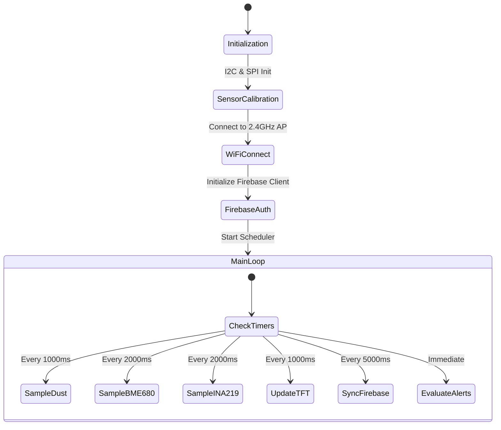

# 04. Software & Cloud Specification

## 1. Firmware Architecture (C/C++)

The firmware is developed using the **PlatformIO ecosystem** on the **Arduino Framework** for the ESP32-C3. The software executes a non-blocking, multi-interval scheduling loop to ensure timely sensor sampling, local rendering, and network synchronization.



---

## 2. Sensor Signal Processing Algorithms

### 2.1. Sharp GP2Y1010AU0F Microsecond Timing & Calibration
The optical dust sensor requires microsecond-accurate pulse modulation to energize the infrared emitter diode (IRED) and sample the scattered light:

1. Drive `GPIO 3` (DUST_LED_PIN) LOW to activate the internal IRED.
2. Wait precisely $280 \mu s$ ($0.28 ms$) for the light pulse and optical reflection to stabilize.
3. Sample the analog voltage on `GPIO 4` (DUST_VO_PIN) using the ESP32-C3 12-bit ADC (`ADC_11db` attenuation, sampling duration $\approx 40 \mu s$).
4. Drive `GPIO 3` HIGH to deactivate the IRED (total pulse duration: $320 \mu s$).
5. Wait for $9680 \mu s$ to complete the standard $10 ms$ operating cycle.

#### Mathematical Conversion & Hardware Scaling:
The analog output $V_o$ from the GP2Y1010AU0F can reach up to $\approx 4.5V - 5.0V$. A hardware resistor voltage divider is placed at the analog pin to scale the signal to within the ESP32-C3 ADC range ($\le 3.3V$), introducing a scaling correction factor of $1.5$:

$$V_{raw} = \text{ADC\_Value} \times \left(\frac{3.3\text{V}}{4095}\right)$$
$$V_{Vo} = V_{raw} \times 1.5$$

Applying the calibrated Sharp linear transfer function:
$$\text{Dust Density } (\text{mg/m}^3) = \max\left(0.0, \; 0.17 \times V_{Vo} - 0.1\right)$$

To convert to standard $\mu g/m^3$:
$$\text{Dust Density } (\mu\text{g/m}^3) = \text{Dust Density } (\text{mg/m}^3) \times 1000$$

A **5-sample Moving Average Filter (MAF)** is applied to smooth instantaneous noise:
$$\bar{D} = \frac{1}{5} \sum_{i=1}^{5} D_i$$

### 2.2. BME680 Gas Resistance & IAQ Estimation
The BME680 incorporates a metal-oxide (MOX) gas sensor heated to 320°C for 150 ms before readout. Higher gas resistance ($R_{gas}$ in $k\Omega$) indicates cleaner air, while lower resistance corresponds to elevated volatile organic compounds (VOCs).

- **Gas Resistance Formula:**
  $$R_{gas} (\text{k}\Omega) = \frac{\text{raw\_resistance}}{1000.0}$$
- **Categorization:**
  - $R_{gas} \ge 150 \, k\Omega$: Good (clean indoor air).
  - $50 \, k\Omega \le R_{gas} < 150 \, k\Omega$: Moderate.
  - $R_{gas} < 50 \, k\Omega$: Hazardous (Elevated VOC / cooking smoke / solvent vapors).

### 2.3. Battery State-of-Charge (SoC) Calculation
The INA219 measures the 2S battery pack bus voltage ($V_{bus}$). The remaining capacity percentage is calculated using a linear interpolation across the 2S operational range ($6.0\text{V}$ cutoff to $8.4\text{V}$ fully charged):

$$\text{Battery SoC (\%)} = \min\left(100, \; \max\left(0, \; \frac{V_{bus} - 6.0\text{V}}{8.4\text{V} - 6.0\text{V}} \times 100\right)\right)$$

In the firmware implementation:
```cpp
float batteryPct = (busvoltage - 6.0) / (8.4 - 6.0) * 100.0;
if (batteryPct > 100) batteryPct = 100;
if (batteryPct < 0) batteryPct = 0;
```

---

## 3. Google Firebase Cloud Specification

### 3.1. Database Architecture
Data is synchronized to the **Firebase Realtime Database (RTDB)** using an optimized JSON hierarchical structure:

```json
{
  "iaq_stations": {
    "ESP32C3_STATION_01": {
      "metadata": {
        "firmware_version": "1.0.0",
        "device_name": "Living Room Monitor",
        "last_seen": 1726848000
      },
      "live_metrics": {
        "temperature_c": 26.4,
        "humidity_pct": 58.1,
        "pressure_hpa": 1013.2,
        "gas_resistance_kohm": 142.5,
        "pm25_ug_m3": 18.3,
        "iaq_grade": "GOOD",
        "timestamp": 1726848000
      },
      "power_telemetry": {
        "bus_voltage_v": 7.94,
        "current_ma": 92.6,
        "power_mw": 735.2,
        "battery_pct": 81,
        "charging_state": false
      },
      "alerts": {
        "active": false,
        "type": "NONE",
        "message": "Air quality is optimal."
      },
      "history": {
        "-O7x9A1b2c3d4e5f": {
          "timestamp": 1726848000,
          "pm25": 18.3,
          "voc_kohm": 142.5,
          "temp": 26.4,
          "hum": 58.1,
          "v_bat": 7.94
        }
      }
    }
  }
}
```

### 3.2. Firebase Security Rules
Granular rules enforce that the ESP32-C3 can only write to its designated station node while authenticated:

```json
{
  "rules": {
    "iaq_stations": {
      "$station_id": {
        ".read": true,
        ".write": "auth != null || auth.uid === $station_id"
      }
    }
  }
}
```

---

## 4. Alert & Threshold Logic

| Parameter | Operational Threshold | Hardware Trigger | UI & System Action |
| :--- | :--- | :--- | :--- |
| **PM2.5 Dust** | $> 0.15 \, \text{mg/m}^3$ ($150 \, \mu\text{g/m}^3$) | `dustDensity > 0.15` | TFT text turns RED (`COLOR_WARN`); Buzzer sounds alert beep ($200\text{ms}$) |
| **Battery SoC** | $< 20.0\%$ ($V_{bus} < 6.48\text{V}$) | `batteryPct < 20.0` | Battery icon turns RED; Buzzer sounds low-power warning |
| **Temperature** | $> 35.0^\circ\text{C}$ | `temp > 35.0` | Temperature reading turns RED (`COLOR_WARN`) |
| **BME680 VOC** | $< 50.0 \, \text{k}\Omega$ | Low gas resistance | Environmental quality status degrades on TFT |
